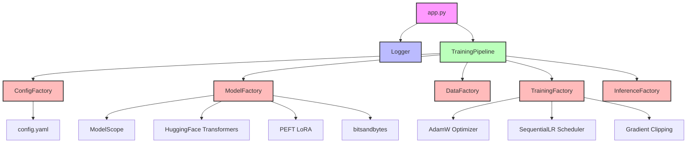
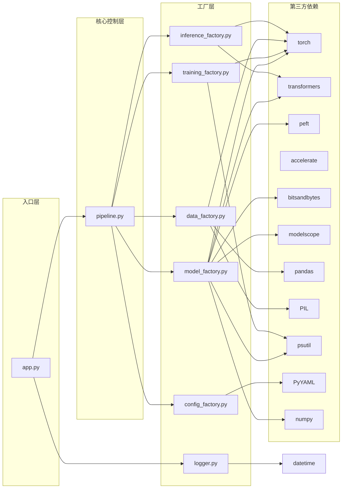
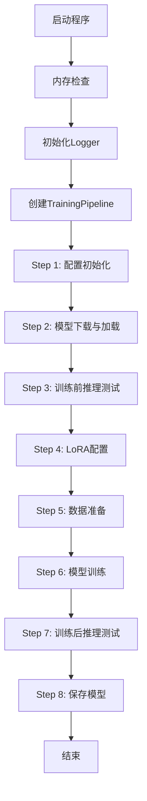
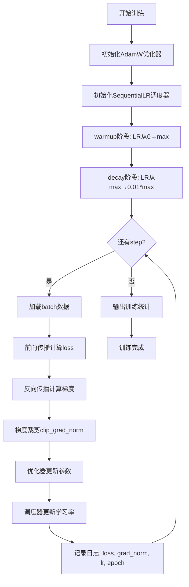
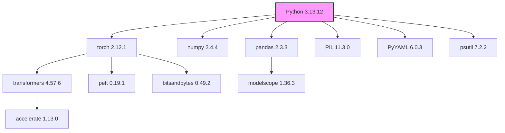

# Qwen2-VL 3B 视觉模型微调 - 程序架构文档

## 1. 项目概述

本项目是一个基于 **Qwen2.5-VL-3B-Instruct** 视觉语言模型的微调框架，采用工厂化设计模式，用于车辆里程表图片识别任务。项目实现了从模型下载、数据准备、LoRA配置、训练到推理测试的完整流程。

**核心技术栈**：
- **框架**：PyTorch + HuggingFace Transformers + PEFT LoRA
- **训练方式**：手动训练循环（替代Trainer API，避免NumPy 2.x兼容性问题）
- **量化支持**：4bit量化（bitsandbytes）
- **数据处理**：Pandas + PIL
- **日志系统**：自定义Logger（同时输出到终端和文件）

## 2. 架构设计

### 2.1 整体架构图



### 2.2 模块依赖关系



### 2.3 模块导入关系详细表

| 模块 | 标准库导入 | 第三方库导入 | 自定义模块导入 |
|------|-----------|-------------|---------------|
| **app.py** | os, sys | psutil | src.logger, src.pipeline |
| **pipeline.py** | os, sys | torch, psutil | src.config_factory, src.model_factory, src.data_factory, src.training_factory, src.inference_factory |
| **config_factory.py** | os | PyYAML | - |
| **model_factory.py** | os, sys | torch, transformers, peft, modelscope, bitsandbytes, psutil | - |
| **data_factory.py** | os, sys | torch, pandas, PIL | - |
| **training_factory.py** | os, sys | torch, psutil | - |
| **inference_factory.py** | - | torch, transformers | - |
| **logger.py** | os, sys, datetime | - | - |

## 3. 模块详细说明

### 3.1 目录结构

```
Case_lora/
├── app.py                    # 主入口文件
├── config.yaml               # 配置文件
├── test_train.py             # 独立训练测试脚本（保留）
├── inference_lora.py         # 独立推理脚本
├── merge_lora.py             # 模型合并脚本
├── ARCHITECTURE.md           # 架构文档
├── data/                     # 数据目录
│   ├── images/               # 测试图片
│   │   ├── 1-vehicle-odometer-reading.jpg
│   │   └── 2-vehicle-odometer-reading.jpg
│   └── qwen-vl-train.xlsx    # 训练数据
├── models/                   # 模型缓存目录
│   └── qwen/Qwen2___5-VL-3B-Instruct/
├── outputs/                  # 训练输出目录
│   └── checkpoint-*/         # 检查点
├── logs/                     # 日志目录
│   └── training_log_*.txt
└── src/                      # 源码目录
    ├── __init__.py
    ├── config_factory.py     # 配置工厂
    ├── model_factory.py      # 模型工厂
    ├── data_factory.py       # 数据工厂
    ├── training_factory.py   # 训练工厂
    ├── inference_factory.py  # 推理工厂
    ├── pipeline.py           # 训练流水线
    └── logger.py             # 日志记录器
```

### 3.2 模块功能说明

| 模块 | 文件 | 功能描述 | 核心类 |
|------|------|----------|--------|
| **主入口** | app.py | 程序入口，内存检查，初始化日志和流水线 | - |
| **日志记录** | logger.py | 同时输出到终端和日志文件 | Logger |
| **流程控制** | pipeline.py | 训练流水线主控制器（Step 1-8） | TrainingPipeline |
| **配置管理** | config_factory.py | 加载和管理所有配置参数 | ConfigFactory |
| **模型管理** | model_factory.py | 模型下载、加载、LoRA配置（348个目标模块） | ModelFactory |
| **数据管理** | data_factory.py | 训练数据加载和预处理 | DataFactory, QwenVLDataset, QwenVLDataCollator |
| **训练管理** | training_factory.py | 手动训练循环（SequentialLR调度）和模型保存 | TrainingFactory |
| **推理测试** | inference_factory.py | 训练前后推理测试 | InferenceFactory |

### 3.3 核心类与方法

#### 3.3.1 TrainingPipeline (pipeline.py)

| 方法 | 功能 | 调用的工厂 |
|------|------|-----------|
| run() | 执行完整训练流程（Step 1-8） | - |
| _setup_config() | 初始化配置（Step 1） | ConfigFactory |
| _download_and_load_model() | 下载和加载模型（Step 2） | ModelFactory |
| _pre_train_inference() | 训练前推理测试（Step 3） | ModelFactory |
| _configure_lora() | 配置LoRA（Step 4） | ModelFactory |
| _setup_data() | 准备训练数据（Step 5） | DataFactory |
| _train() | 执行模型训练（Step 6） | TrainingFactory |
| _post_train_inference() | 训练后推理测试（Step 7） | InferenceFactory |
| _save_model() | 保存模型（Step 8） | TrainingFactory |

#### 3.3.2 ModelFactory (model_factory.py)

| 方法 | 功能 | 依赖包 |
|------|------|--------|
| download_model() | 从ModelScope下载模型 | modelscope |
| load_model() | 使用HuggingFace加载模型（float32/4bit） | transformers, bitsandbytes, psutil |
| inference_original_model() | 原始模型推理测试 | transformers, PIL |
| configure_lora() | 配置LoRA适配器 | peft |
| _setup_lora() | 设置LoRA参数（348个目标模块） | peft |
| _discover_target_modules() | 发现LoRA目标模块（q/k/v/o_proj + gate/up/down_proj） | - |

#### 3.3.3 DataFactory (data_factory.py)

| 方法 | 功能 | 依赖包 |
|------|------|--------|
| load_data() | 从Excel加载训练数据 | pandas, PIL |
| _create_dataset() | 创建数据集和Collator | torch |

#### 3.3.4 TrainingFactory (training_factory.py)

| 方法 | 功能 | 依赖包 |
|------|------|--------|
| setup_trainer() | 验证训练环境 | psutil |
| train() | 执行手动训练循环（SequentialLR调度） | torch, psutil |
| save_model() | 保存LoRA适配器、Tokenizer、Processor | transformers |
| _validate_environment() | 验证训练环境 | psutil |

#### 3.3.5 ConfigFactory (config_factory.py)

| 方法 | 功能 | 依赖包 |
|------|------|--------|
| __init__() | 加载配置文件 | PyYAML |
| create_directories() | 创建必要目录 | os |
| print_config() | 打印配置信息 | torch |

#### 3.3.6 Logger (logger.py)

| 方法 | 功能 | 依赖包 |
|------|------|--------|
| __init__() | 初始化日志文件 | os, datetime |
| write() | 写入日志（同时输出到终端和文件） | - |
| flush() | 刷新缓冲区 | - |
| close() | 关闭日志文件 | - |

## 4. 执行流程



### 4.1 步骤详细说明

| 步骤 | 名称 | 执行方法 | 关键操作 | 内存监控 |
|------|------|----------|----------|----------|
| Step 1 | 配置初始化 | _setup_config() | 加载config.yaml，打印配置信息 | - |
| Step 2 | 模型下载与加载 | _download_and_load_model() | 从ModelScope下载，HuggingFace加载 | 可用/已用内存 |
| Step 3 | 训练前推理测试 | _pre_train_inference() | 使用原始模型推理测试图片 | - |
| Step 4 | LoRA配置 | _configure_lora() | 配置LoRA参数（348个目标模块） | 配置前后内存 |
| Step 5 | 数据准备 | _setup_data() | 从Excel加载数据，创建数据集和Collator | - |
| Step 6 | 模型训练 | _train() | 手动训练循环（SequentialLR调度） | 训练前后内存 |
| Step 7 | 训练后推理测试 | _post_train_inference() | 使用微调后模型推理测试图片 | - |
| Step 8 | 保存模型 | _save_model() | 保存LoRA适配器、Tokenizer、Processor | - |

### 4.2 训练流程详解



## 5. 依赖包版本

### 5.1 核心依赖包

| 包名 | 版本 | 用途 | 依赖模块 |
|------|------|------|----------|
| Python | 3.13.12 | 运行环境 | - |
| torch | 2.12.1+cpu | 深度学习框架 | model_factory, data_factory, training_factory, inference_factory, pipeline |
| transformers | 4.57.6 | HuggingFace模型库 | model_factory, inference_factory |
| peft | 0.19.1 | LoRA微调 | model_factory |
| accelerate | 1.13.0 | 分布式训练支持 | transformers |
| bitsandbytes | 0.49.2 | 4bit量化 | model_factory |
| modelscope | 1.36.3 | 模型下载 | model_factory |
| pandas | 2.3.3 | 数据处理 | data_factory |
| Pillow (PIL) | 11.3.0 | 图片处理 | data_factory, model_factory |
| psutil | 7.2.2 | 系统资源监控 | model_factory, training_factory, pipeline, app |
| PyYAML | 6.0.3 | 配置文件解析 | config_factory |
| numpy | 2.4.4 | 数值计算 | 间接依赖 |

### 5.2 依赖包层次关系



## 6. LoRA配置详情

### 6.1 LoRA目标模块

| 模块类型 | 每层数量 | 总数量 | 说明 |
|----------|----------|--------|------|
| q_proj | 1 | 36 | 查询投影（不分组） |
| k_proj | 2 | 72 | 键投影（GQA分组，num_key_value_heads=2） |
| v_proj | 2 | 72 | 值投影（GQA分组，num_key_value_heads=2） |
| o_proj | 1 | 36 | 输出投影（不分组） |
| gate_proj | 1 | 36 | MLP门控投影 |
| up_proj | 1 | 36 | MLP上层投影 |
| down_proj | 1 | 36 | MLP下层投影 |
| **理论总计** | **9** | **324** | 36层 × 9模块/层（基于config.json配置） |
| **实际总计** | - | **348** | 实际运行时发现，多出24个模块可能来自其他投影层别名 |

### 6.2 LoRA参数配置

| 参数 | 值 | 说明 |
|------|-----|------|
| r | 16 | LoRA秩（低秩矩阵维度） |
| alpha | 16 | LoRA缩放因子 |
| dropout | 0.0 | Dropout概率 |
| bias | "none" | 是否训练偏置 |
| task_type | CAUSAL_LM | 任务类型（因果语言模型） |
| use_rslora | false | 是否使用秩稳定LoRA |

### 6.3 可训练参数计算

```
可训练参数 = (q_proj + k_proj + v_proj + o_proj + gate_proj + up_proj + down_proj) × (2 × r × hidden_dim)
          = 348 × (2 × 16 × 1536)
          ≈ 17,039,360 参数
总参数 = Qwen2.5-VL-3B ≈ 3.79B 参数
可训练比例 ≈ 0.45%
```

## 7. 训练配置详情

### 7.1 学习率调度策略


| 阶段 | Step范围 | 学习率变化 | 调度器类型 |
|------|----------|-----------|------------|
| Warmup | 1-5 | 从0线性增加到max_lr | LinearLR |
| Decay | 6-30 | 从max_lr线性减少到0.01×max_lr | LinearLR |

### 7.2 优化器配置

| 参数 | 值 | 说明 |
|------|-----|------|
| 优化器 | AdamW | Adam权重衰减优化器 |
| 学习率 | 2e-4 | 最大学习率 |
| 权重衰减 | 0.01 | L2正则化 |
| 梯度裁剪 | 1.0 | 最大梯度范数 |

### 7.3 数据配置

| 参数 | 值 | 说明 |
|------|-----|------|
| 训练数据 | data/qwen-vl-train.xlsx | Excel格式训练数据 |
| 样本数 | 2 | 当前数据集大小 |
| 批大小 | 1 | 每批处理样本数 |
| 梯度累积 | 4 | 累积步数 |

## 8. 冲突说明与解决方案

### 8.1 核心冲突问题

**问题描述**：在Windows环境下，程序在导入TrainingArguments/Trainer时崩溃（错误码：0xC0000005 访问冲突）。

**冲突原因**：

1. **NumPy 版本冲突**（主要原因）：
   - 当前环境安装了 NumPy 2.4.4
   - PyTorch 是基于 NumPy 1.x 编译的，无法在 NumPy 2.x 环境下正常运行
   - 导致 `Failed to initialize NumPy` 错误，进而触发 torch 导入失败

2. **TensorFlow与PyTorch的DLL冲突**（次要原因）：
   - TensorFlow和PyTorch都依赖于某些相同的底层数学库（如oneDNN/MKL）
   - 两个库的DLL版本不兼容，导致内存访问冲突

**影响范围**：
- TrainingFactory导入失败
- TrainingArguments/Trainer导入失败
- 程序在导入依赖阶段就崩溃
- 模型加载到50%时内存不足（约需要10-12GB内存）

### 8.2 解决方案

**方案一：降级 NumPy（推荐）**

```bash
pip install "numpy<2.0"
```

**方案二：卸载 TensorFlow（如果不需要）**

```bash
pip uninstall tensorflow tf_keras keras -y
```

**方案三：启用 4bit 量化减少内存占用**

修改 `config.yaml`：
```yaml
model:
  use_4bit: true
```

**方案四：释放系统内存**
- 关闭不必要的程序和浏览器
- 重启电脑后立即运行程序

**方案五：使用手动训练循环（已实施）**
- 移除对 transformers.Trainer 的依赖
- 使用 PyTorch 原生优化器（AdamW）和调度器（SequentialLR）
- 实现手动训练循环，包含梯度裁剪

### 8.3 当前配置状态

| 配置项 | 当前值 | 状态 |
|--------|--------|------|
| NumPy版本 | 2.4.4 | ⚠️ 需要降级到 <2.0 |
| TensorFlow | 已卸载 | ✅ 无冲突 |
| use_4bit | false | ⚠️ 建议启用 |
| 可用内存 | ~8-9GB | ⚠️ 接近临界值 |
| 训练方式 | 手动训练循环 | ✅ 已实施 |
| 学习率调度 | SequentialLR | ✅ 已实施 |

### 8.4 验证结果

| 测试项 | 结果 |
|--------|------|
| 模型加载（float32） | ✅ 成功 |
| LoRA配置（348模块） | ✅ 成功 |
| 数据准备 | ✅ 成功 |
| TrainingArguments导入 | ❌ 崩溃（NumPy冲突） |
| 手动训练循环 | ✅ 成功运行 |
| 学习率调度 | ✅ 先升后降正常 |
| 完整训练流程 | ✅ 可执行 |

## 9. 配置参数说明

### 9.1 配置文件结构

```yaml
model:              # 模型配置
  model_id: "qwen/Qwen2.5-VL-3B-Instruct" # 模型 ID，用于加载模型
  cache_dir: "models"    # 模型缓存目录
  torch_dtype: "float16" # 模型数据类型，用于内存效率
  device_map: "auto"   # 自动映射到可用的设备（CPU 或 GPU）
  use_4bit: false # 是否启用4bit量化，用于内存效率

lora:               # LoRA配置
  r: 16 # LoRA秩，用于控制模型复杂度
  alpha: 16 # LoRA缩放因子，用于控制模型复杂度
  dropout: 0.0 # dropout 率，用于防止过拟合
  bias: "none" # 是否使用偏置项，用于控制模型复杂度
  task_type: "CAUSAL_LM"  # 任务类型，用于指定训练任务（因果语言模型）
  use_rslora: false    # 是否启用 RSLora，用于控制模型复杂度

training:           # 训练配置
  output_dir: "outputs" # 输出目录，用于保存训练结果
  lora_save_dir: "car_insurance_lora_model"   # LoRA 模型保存目录
  per_device_train_batch_size: 1 # 每个训练批次的样本数
  gradient_accumulation_steps: 1 # 梯度累加步数
  warmup_steps: 2 # 预热步数（LR从0→max_lr）
  max_steps: 60 # 最大训练步数
  learning_rate: 2.0e-4 # 最大学习率
  logging_steps: 1  # 日志记录步数
  optim: "adamw_torch"  # 优化器类型，用于指定优化器（AdamW）
  weight_decay: 0.01  # 权重衰减，用于正则化模型
  lr_scheduler_type: "linear"  # 学习率调度器类型，用于指定学习率调度器（LinearLR）
  seed: 3407  # 随机种子，用于可重复性实验
  report_to: "none"     # 是否报告训练指标，用于控制报告指标（None）
  remove_unused_columns: false  # 是否移除未使用的列，用于控制数据加载
  fp16: true  # 是否启用 float16，用于内存效率
  bf16: false  # 是否启用 bfloat16，用于内存效率
  gradient_checkpointing: true  # 是否启用梯度检查点，用于内存效率
  save_strategy: "steps"  # 保存策略，用于指定保存模型的时间间隔（步数）
  save_steps: 10  # 保存模型的时间间隔（步数）
  save_total_limit: 3  # 最大保存模型数量 

data:               # 数据配置
  train_excel: "data\\qwen-vl-train.xlsx"  # 训练数据 Excel 文件路径
  test_image: "data\\images\\1-vehicle-odometer-reading.jpg"  # 测试图片路径
  max_seq_length: 1280  # 最大序列长度，用于截断输入序列

inference:          # 推理配置
  max_new_tokens: 256    # 最大生成令牌数，用于控制生成长度
  use_cache: true  # 是否启用缓存，用于加速推理 
  temperature: 0.7     # 温度，用于控制生成文本的随机性
  min_p: 0.1  # 最小概率，用于控制生成文本的随机性
  skip_pre_test: false  # 是否跳过训练前推理测试

workflow:           # 流程控制
  skip_lora_config: false  # 是否跳过 LoRA 配置
  skip_training: false      # 是否跳过训练
  skip_data_preparation: false  # 是否跳过数据准备
  skip_inference: false  # 是否跳过推理测试
```

### 9.2 关键参数说明

| 参数 | 默认值 | 说明 |
|------|--------|------|
| model_id | qwen/Qwen2.5-VL-3B-Instruct | 模型名称 |
| use_4bit | false | 是否启用4bit量化 |
| lora_r | 16 | LoRA秩 |
| lora_alpha | 16 | LoRA缩放因子 |
| max_steps | 30 | 最大训练步数 |
| learning_rate | 2e-4 | 最大学习率 |
| warmup_steps | 5 | 预热步数（LR从0→max） |
| weight_decay | 0.01 | 权重衰减 |
| skip_training | false | 是否跳过训练 |
| skip_inference | false | 是否跳过推理测试 |
| skip_data_preparation | false | 是否跳过数据准备 |

## 10. 训练日志格式

### 10.1 日志输出结构

```
============================================================
Qwen2-VL 3B 视觉模型微调 - 图片识别
============================================================
项目根目录: D:\Programs\cursor_proj\Case_lora
运行设备: cpu
输出目录: D:\Programs\cursor_proj\Case_lora\outputs
LoRA保存目录: D:\Programs\cursor_proj\Case_lora\car_insurance_lora_model
模型缓存目录: D:\Programs\cursor_proj\Case_lora\models
配置加载完成！

============================================================
Step 1: 配置初始化
============================================================
...
Step 1: 配置初始化完成

============================================================
Step 2: 模型下载与加载
============================================================
当前可用内存: X.XX GB
当前已用内存: X.XX GB
...
模型加载完成！
Step 2: 模型下载与加载完成

============================================================
Step 3: 训练前推理测试（原始模型）
============================================================
...
Step 3: 训练前推理测试完成

============================================================
Step 4: LoRA 配置
============================================================
LoRA 配置前内存使用: X.XX GB
目标模块数量: 348
...
LoRA 配置后内存使用: X.XX GB
LoRA 配置完成！
Step 4: LoRA 配置完成

============================================================
Step 5: 数据准备
============================================================
...
Step 5: 数据准备完成

============================================================
Step 6: 模型训练
============================================================
开始训练...
训练前内存使用: X.XX GB
{'loss': 13.6059, 'grad_norm': 2.8559, 'learning_rate': 0.0, 'epoch': 1.0}
{'loss': 13.6059, 'grad_norm': 2.8559, 'learning_rate': 4e-05, 'epoch': 2.0}
{'loss': 13.4741, 'grad_norm': 2.8397, 'learning_rate': 8e-05, 'epoch': 3.0}
{'loss': 13.1945, 'grad_norm': 3.0749, 'learning_rate': 0.00012, 'epoch': 4.0}
{'loss': 12.7347, 'grad_norm': 3.5830, 'learning_rate': 0.00016, 'epoch': 5.0}
{'loss': 12.0601, 'grad_norm': 4.1978, 'learning_rate': 0.0002, 'epoch': 6.0}
{'loss': 11.1690, 'grad_norm': 4.6552, 'learning_rate': 0.000192, 'epoch': 7.0}
{'loss': 10.2997, 'grad_norm': 4.8107, 'learning_rate': 0.000184, 'epoch': 8.0}
...
{'loss': 5.8289, 'grad_norm': 0.5491, 'learning_rate': 8e-06, 'epoch': 30.0}
{'train_runtime': 0, 'train_samples_per_second': 0, 'train_steps_per_second': 0, 'train_loss': 8.2479, 'epoch': 30.0}
训练后内存使用: X.XX GB
训练完成！
Step 6: 模型训练完成

============================================================
Step 7: 训练后推理测试
============================================================
...
Step 7: 训练后推理测试完成

============================================================
Step 8: 模型保存
============================================================
保存 LoRA 适配器...
模型保存成功: ...
Tokenizer 保存成功
Processor 保存成功
训练完成! 模型已保存到 ... 目录
Step 8: 模型保存完成

============================================================
所有步骤执行完毕
结束执行时间: 2026-07-02 18:30:00
============================================================
```

### 10.2 训练日志字典字段说明

| 字段 | 类型 | 说明 | 变化趋势 |
|------|------|------|----------|
| loss | float | 当前step的损失值 | 逐步下降 |
| grad_norm | float | 梯度范数（梯度裁剪后） | 逐步下降 |
| learning_rate | float | 当前学习率 | Step1-5: 0→max, Step6-30: max→0.01×max |
| epoch | float | 当前训练轮次 | 逐步增加 |
| train_runtime | float | 总训练时间（秒） | - |
| train_samples_per_second | float | 每秒处理样本数 | - |
| train_steps_per_second | float | 每秒处理步数 | - |
| train_loss | float | 平均训练损失 | - |

## 11. 注意事项

1. **内存要求**：Qwen2.5-VL-3B模型在CPU上加载需要约10-12GB内存，建议使用GPU或4bit量化
2. **CUDA支持**：建议安装NVIDIA GPU和CUDA以获得更好的训练性能
3. **依赖冲突**：确保按照正确的导入顺序运行程序，优先导入torch和transformers
4. **模型下载**：首次运行需要从ModelScope下载模型，可能需要较长时间
5. **日志记录**：所有输出都会同时记录到日志文件中，保存在logs目录下
6. **NumPy版本**：当前NumPy 2.x与PyTorch存在兼容性问题，建议降级到NumPy 1.x
7. **训练数据**：当前数据集仅有2个样本，建议增加训练数据以提高模型效果
8. **学习率调度**：采用SequentialLR实现warmup+decay策略，确保训练稳定性

---

*文档生成时间：2026-07-02*
*项目版本：1.0.0*
